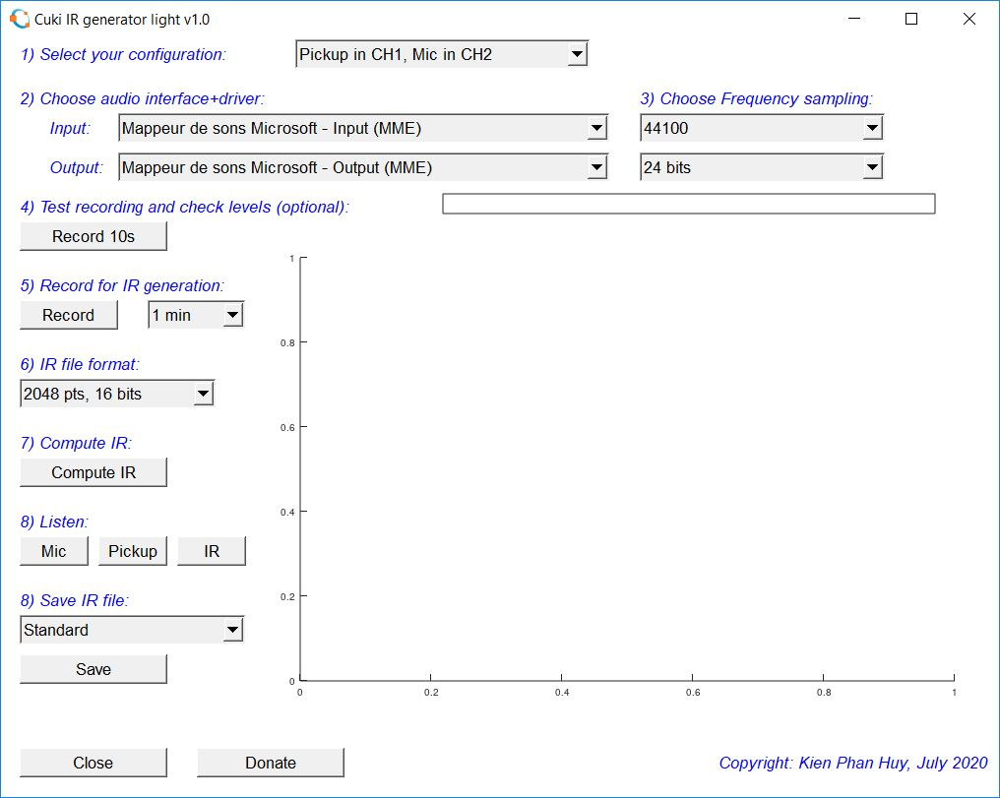

# Cuki-IR-generator

Cuki-IR-generator is a Software to generate IR files from acoustic instruments. This version works on GNU Octave and needs no packages. So it is very easy to use.

I started to develop this program years ago. This is a "light" version of the program I initially created using MATLAB.

Acoustic guitar IR generator "light" 1.0
Author: Kien Phan Huy on the 14th of July 2020. Copyright 2020

All you need is:
* A computer (Mac, PC)
* A 2-channel audio interface
* A microphone
* An acoustic guitar with an onboard pickup
* 2 cables (one for the mic, one for the guitar)
* GNU Octave [GNU Octave](https://www.gnu.org/software/octave/download) installed on your computer.

# Usage

* Download and install [GNU Octave](https://www.gnu.org/software/octave/download)
*  Download [Cuki-IR-generator official realease from http://acousticir.free.fr](http://acousticir.free.fr/IMG/zip/cuki_ir_gen1r.m.zip) or clone this repository.
* Run GNU Octave and **make sure to choose the working directory where you saved the IR generator program**
* Open the script Cuki_IR_gen1r.m and run it.
* Follow the steps on [the youtube video](https://youtu.be/5-6pklunzkI)

## For Linux Users
* The save button is not visible by default, so you need to activated by replacing all occurrences of `ispc` with `ispc|isunix`.

# Version history

* **Version v1.0p uploaded 24/07/2020
Filename: Cuki_IR_gen1p.m**
Bug fix GUI now starts even if you have more audio-interface outputs than inputs

* **Version v1.0r uploaded 28/11/2020
Filename: Cuki_IR_gen1r.m**
Generate an "itp" file with smoother high end. (less harshness)

* **Version v1.0o uploaded 22/07/2020
Filename: Cuki_IR_gen1o.m**
Bug fix GUI shrinks with the window

* **Version v1.0n uploaded 21/07/2020
Filename: Cuki_IR_gen1n.m**
Bug fix regarding low mode resonance detection
Added J45 Jon Fields open source algorithm in the save option (Copyright Jon Fields 2020)

* **Version v1.0l uploaded 21/07/2020
Filename: Cuki_IR_gen1l.m**
Bug fix regarding 44100 Hz recordings IR computation
Bug fix regarding double clic on Mic/Pickup/IR
Bug fix regarding clic on Mic/Pickup/IR while Mic/Pickup/IR is already playing

# Copyrigth notice

Uses the Min Phase response computation from J.O. Smith, 1982-2002

Uses amodified version of Oct_spectrum from M. Buzzoni, Dec. 2018

Uses IIR butterworth coefficient computation from Neil Robertson , 12/29/17

Uses embbeded waitbar Yuanfei (2020). Embedding Waitbar Inside A GUI (https://www.mathworks.com/matlabcentral/fileexchange/47896-embedding-waitbar-inside-a-gui), MATLAB Central File Exchange. Retrieved July 15, 2020. 

for which Copyright is reminded in the following:

Copyright (c) 2019, Marco Buzzoni
All rights reserved.

Redistribution and use in source and binary forms, with or without
modification, are permitted provided that the following conditions are met:

* Redistributions of source code must retain the above copyright notice, this
  list of conditions and the following disclaimer.

* Redistributions in binary form must reproduce the above copyright notice,
  this list of conditions and the following disclaimer in the documentation
  and/or other materials provided with the distribution
* Neither the name of Università degli Studi di Ferrara nor the names of its
  contributors may be used to endorse or promote products derived from this
  software without specific prior written permission.
THIS SOFTWARE IS PROVIDED BY THE COPYRIGHT HOLDERS AND CONTRIBUTORS "AS IS"
AND ANY EXPRESS OR IMPLIED WARRANTIES, INCLUDING, BUT NOT LIMITED TO, THE
IMPLIED WARRANTIES OF MERCHANTABILITY AND FITNESS FOR A PARTICULAR PURPOSE ARE
DISCLAIMED. IN NO EVENT SHALL THE COPYRIGHT OWNER OR CONTRIBUTORS BE LIABLE
FOR ANY DIRECT, INDIRECT, INCIDENTAL, SPECIAL, EXEMPLARY, OR CONSEQUENTIAL
DAMAGES (INCLUDING, BUT NOT LIMITED TO, PROCUREMENT OF SUBSTITUTE GOODS OR
SERVICES; LOSS OF USE, DATA, OR PROFITS; OR BUSINESS INTERRUPTION) HOWEVER
CAUSED AND ON ANY THEORY OF LIABILITY, WHETHER IN CONTRACT, STRICT LIABILITY,
OR TORT (INCLUDING NEGLIGENCE OR OTHERWISE) ARISING IN ANY WAY OUT OF THE USE
OF THIS SOFTWARE, EVEN IF ADVISED OF THE POSSIBILITY OF SUCH DAMAGE.

``Introduction to Digital Filters with Audio Applications'', by Julius O. Smith III, (September 2007 Edition).
Copyright © 2020-05-11 by Julius O. Smith III
Center for Computer Research in Music and Acoustics (CCRMA),   Stanford University

Copyright (c) 2014, Yuanfei
All rights reserved.

Redistribution and use in source and binary forms, with or without
modification, are permitted provided that the following conditions are met:

* Redistributions of source code must retain the above copyright notice, this
  list of conditions and the following disclaimer.

* Redistributions in binary form must reproduce the above copyright notice,
  this list of conditions and the following disclaimer in the documentation
  and/or other materials provided with the distribution
* Neither the name of  nor the names of its
  contributors may be used to endorse or promote products derived from this
  software without specific prior written permission.
THIS SOFTWARE IS PROVIDED BY THE COPYRIGHT HOLDERS AND CONTRIBUTORS "AS IS"
AND ANY EXPRESS OR IMPLIED WARRANTIES, INCLUDING, BUT NOT LIMITED TO, THE
IMPLIED WARRANTIES OF MERCHANTABILITY AND FITNESS FOR A PARTICULAR PURPOSE ARE
DISCLAIMED. IN NO EVENT SHALL THE COPYRIGHT OWNER OR CONTRIBUTORS BE LIABLE
FOR ANY DIRECT, INDIRECT, INCIDENTAL, SPECIAL, EXEMPLARY, OR CONSEQUENTIAL
DAMAGES (INCLUDING, BUT NOT LIMITED TO, PROCUREMENT OF SUBSTITUTE GOODS OR
SERVICES; LOSS OF USE, DATA, OR PROFITS; OR BUSINESS INTERRUPTION) HOWEVER
CAUSED AND ON ANY THEORY OF LIABILITY, WHETHER IN CONTRACT, STRICT LIABILITY,
OR TORT (INCLUDING NEGLIGENCE OR OTHERWISE) ARISING IN ANY WAY OUT OF THE USE
OF THIS SOFTWARE, EVEN IF ADVISED OF THE POSSIBILITY OF SUCH DAMAGE.
